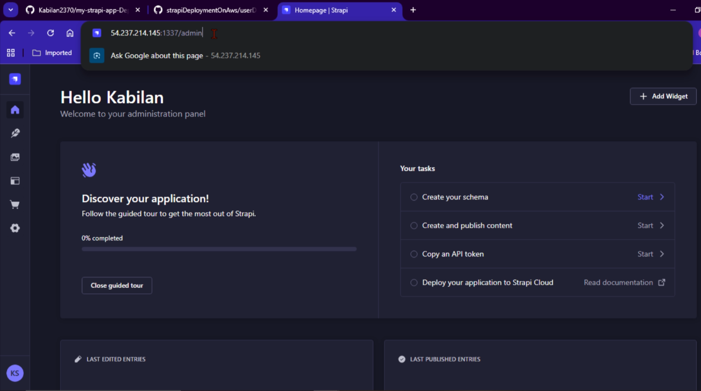

# strapiDeploymentOnAws

<h2>This is the project explanation video. I have attached a Google Drive link with my voice-over walkthrough. You can click and view it.</h2>

https://drive.google.com/file/d/1jm6thmLNyjqwCwpR-EFfkNuNbqnaZ6Tg/view?usp=sharing

I have created a Strapi project and updated on my github repo first. This is url of my straip project

[Strapi_project](https://github.com/Kabilan2370/my-strapi-app-Deployment.git)

